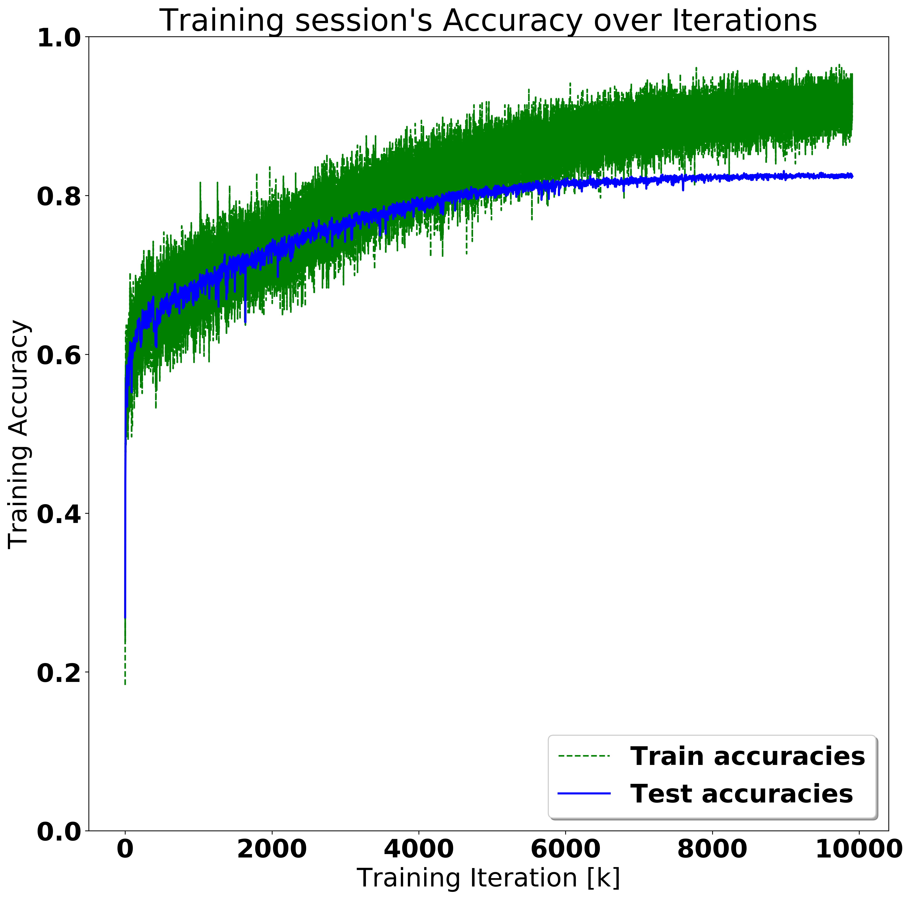
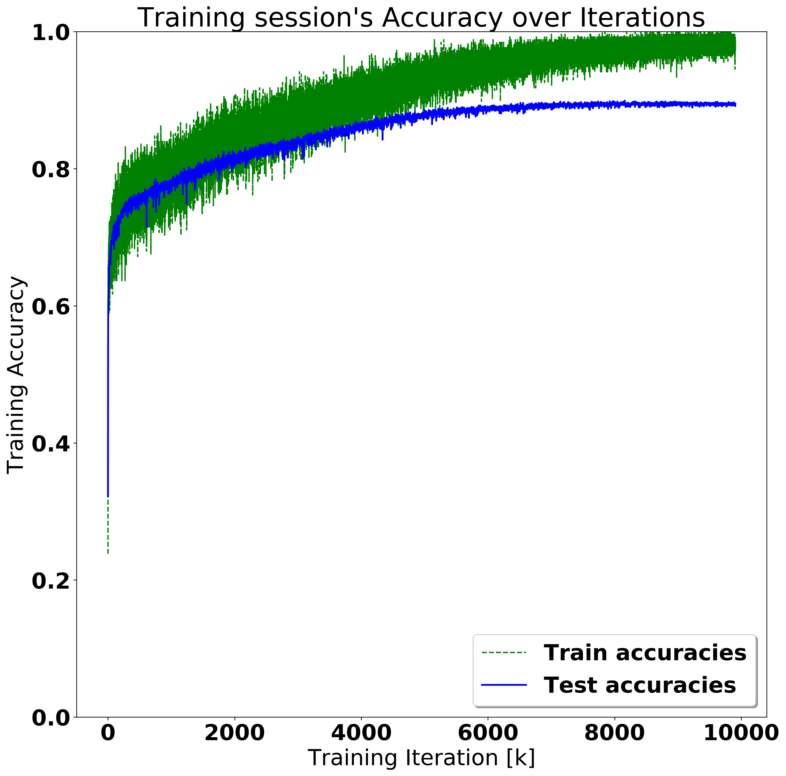
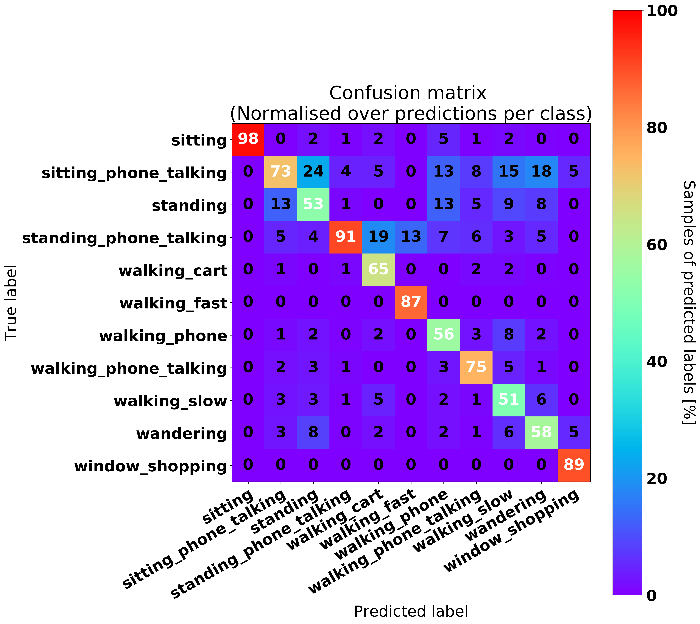
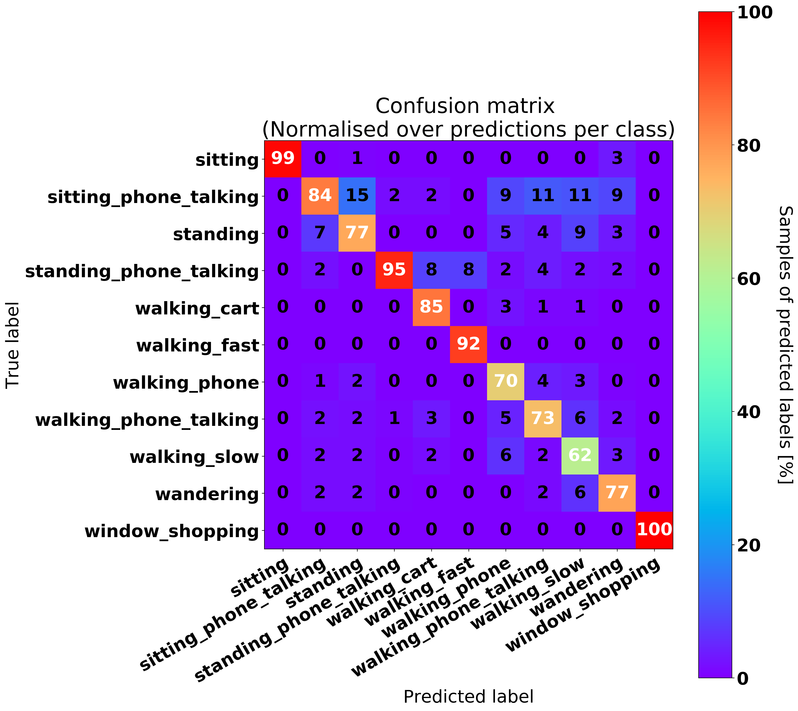
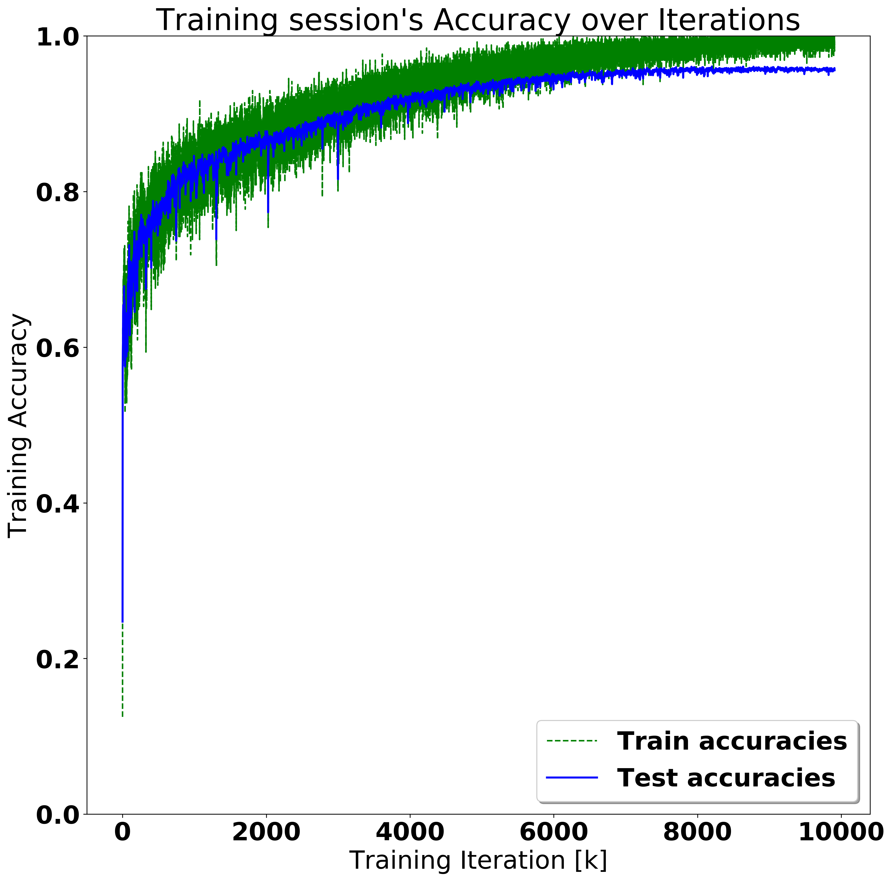
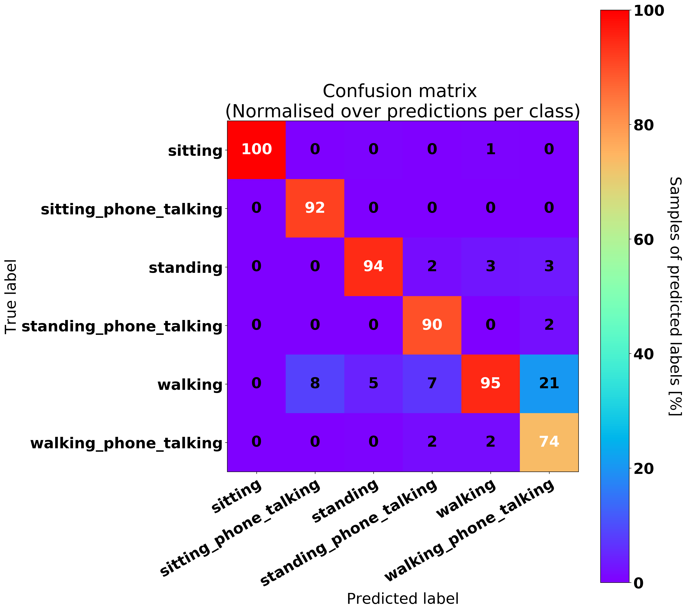
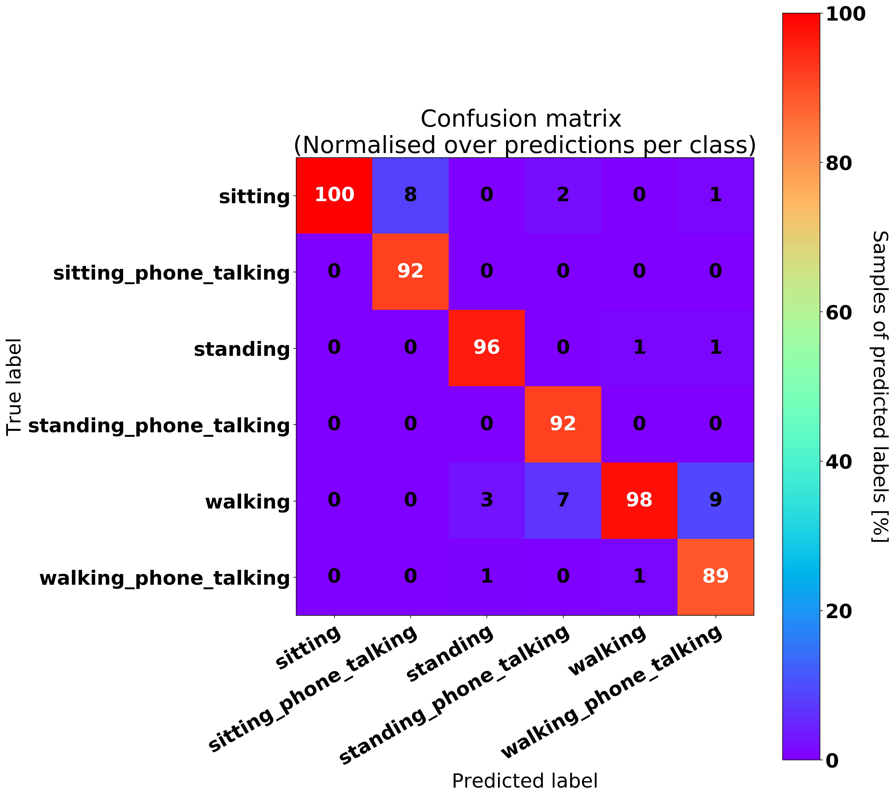

# Human Activity recognition

In `data/` it is stored the data set of skeletal poses for the Human 
Activity Recognition RNN-

The weights of the model is in `model/` as a tensorflow session.

### Repository Exploration

| Repository | Technologies | Notes |
| --- | --- | --- |
| [Spatial Temporal GCN](https://github.com/yysijie/st-gcn/) | ~~CUDA~~ | - use OpenPose as preliminary stage|
| [Deep_SORT](https://github.com/TianzhongSong/Real-Time-Action-Recognition) | | TO CHECK |
| [RNN for HAR](https://github.com/stuarteiffert/RNN-for-Human-Activity-Recognition-using-2D-Pose-Input/) | Tensorflow | IMPLEMENTED: use OpenPose skeletons to feed RNN|
| [Deep HAR](https://github.com/dluvizon/deephar) |  | to check |

### Available Data sets

| Name | Data representation | Actions of interest | Notes |
| --- | --- | --- | --- |
| [NTU RGB+D](http://rose1.ntu.edu.sg/Datasets/actionRecognition.asp) | - RGB videos  - 3D skeletal data  - Depth Map sequences  - IR videos | - A8: sit down  - A9: stand up  - A28: phone call  - A29: play with phone/tablet  - A31: point to something  - A38: salute  - A67: hush  - A96: cross arms  | There are mutual actions too, but not interesting for my case |

### Model obtained using RNN for HAR on ITW

Comparison between the model obtainable using all the individual action tags.

On the left, no further pre-processing is done. On the right: skeletons have been proportionally normalised into 100x100 px bounding boxes.
As we can notice the model benefits from normalization in terms of accuracy and "discrimating power" between classes, i.e. less False Positives and False Negatives (especially for 'walking_slow' class).

  <table>
    <tr>
      <td></td>
      <td></td>
    </tr>
    <tr>
    <td></td>
    <td></td>
    </tr>
  </table>

Reducing the number of classes by clustering those with few samples and qualitatively similar (e.g. walking_slow and walking_fast differs by velocity, which can be easily computed independently from the HAR task), the benefit of normalisation becomes more evident:

  <table>
    <tr>
      <td></td>
      <td></td>
    </tr>
    <tr>
      <td></td>
      <td></td>
    </tr>
  </table>

